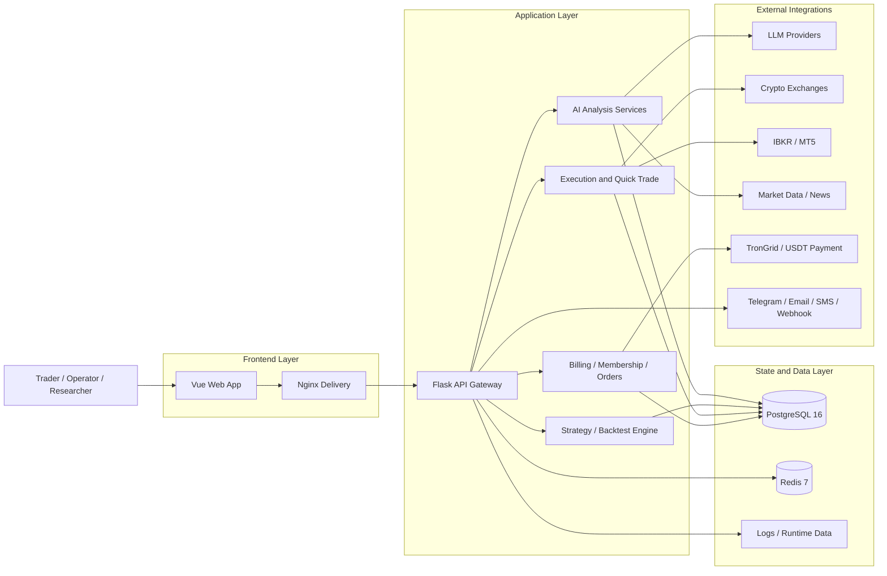

<div align="center">
  <a href="https://github.com/brokermr810/QuantDinger">
    
  </a>

  <h1>QuantDinger</h1>
  <h3>AI-Native Quant Research, Strategy, and Trading Platform</h3>
  <p><strong>From idea to research, backtest, execution, and operations on your own infrastructure.</strong></p>

  <p>
    <a href="README.md"><strong>English</strong></a> &nbsp;·&nbsp;
    <a href="docs/README_CN.md"><strong>简体中文</strong></a> &nbsp;·&nbsp;
    <a href="https://ai.quantdinger.com"><strong>Live Demo</strong></a> &nbsp;·&nbsp;
    <a href="https://youtu.be/HPTVpqL7knM"><strong>Video Demo</strong></a> &nbsp;·&nbsp;
    <a href="https://www.quantdinger.com"><strong>Community</strong></a>
  </p>

  <p>
    <a href="LICENSE"></a>
    
    
    
    
    
  </p>
</div>

---

## Overview

QuantDinger is a self-hosted quantitative trading workspace that brings together AI-assisted market analysis, Python strategy development, backtesting, live execution, portfolio operations, and billing-ready user management in one deployable stack.

The current `v3.0.1` release aligns frontend/runtime versioning, refreshes the public documentation, and refines UI consistency on top of the recent strategy backtesting upgrades already documented in `docs/CHANGELOG.md`.

## Why QuantDinger

- **Self-hosted by design**: you control deployment, credentials, strategy code, and operational data.
- **Research to execution in one product**: market data, AI analysis, indicator/strategy authoring, backtests, and live trading are connected.
- **Python-native workflow**: generate strategies with AI or write them directly with the Python ecosystem you already know.
- **Operator-ready architecture**: Docker Compose, PostgreSQL, Redis, Nginx, health checks, and environment-driven configuration.
- **Commercialization support**: built-in membership plans, credits, USDT payment flows, and admin controls.

## v3.0.1 Highlights

- Frontend versioning, footer display, and release documentation are aligned to `3.0.1`.
- Repository-level README content is rewritten to better match the actual deployment model and product scope.
- Exchange signup/referral links are now documented consistently with the in-app "Open account" entry.
- Backtest Center UI polish continues the recent strategy-backtest productization work introduced in earlier `2.2.x` releases.

## Open Source Repositories

To make the project easier to navigate, the current public repositories are:

| Repository | Purpose |
|------------|---------|
| [QuantDinger](https://github.com/brokermr810/QuantDinger) | Main repository: backend, deployment stack, docs, prebuilt frontend delivery |
| [QuantDinger Frontend](https://github.com/brokermr810/QuantDinger-Vue) | Vue.js frontend source repository for UI development and customization |

## Product Capabilities

### 1. AI Research and Decision Support

- Fast AI analysis pipeline for market interpretation, structured outputs, and historical review.
- Multi-source research inputs: price action, kline data, macro context, news, and fundamentals where applicable.
- Optional memory, similarity retrieval, and calibration flows for more stable decision support.
- Multi-provider LLM support, including OpenRouter, OpenAI, Gemini, DeepSeek, and others configurable by environment variables.

### 2. Indicator and Strategy Workbench

- Natural-language assisted strategy drafting for traders who want to move from idea to executable logic faster.
- Python-native indicator and strategy authoring for teams that need control and extensibility.
- Integrated charting workflow for signal visualization on professional K-line interfaces.
- Community publishing and monetization paths for indicator assets.

### 3. Backtesting and Strategy Persistence

- Historical backtests with stored runs, metrics, trades, and equity curves.
- Support for both indicator-driven and saved strategy-driven backtesting flows.
- Strategy snapshots, configuration persistence, and history review for reproducibility.
- Foundation for AI-assisted post-backtest analysis and iterative refinement.

### 4. Live Trading and Execution

- Direct crypto exchange execution with a unified live trading layer.
- Quick trade workflows for faster manual confirmation and order placement from analysis contexts.
- Support for position lookup, tracked trade history, and close-position workflows.
- Strategy runtime and execution services for automated or semi-automated trading operations.

### 5. Multi-Market Coverage

- Crypto spot and derivatives through multiple exchange integrations.
- US stock connectivity through IBKR and supporting data providers.
- Forex connectivity through MT5 and related infrastructure.
- Prediction-market research for Polymarket analysis workflows.

### 6. Portfolio, Alerts, and Operations

- Portfolio views and monitoring capabilities for account-level oversight.
- Notification hooks for channels such as Telegram, Email, SMS, Discord, and Webhook workflows.
- Admin-oriented settings and service toggles exposed through the application.
- Optional workers for portfolio monitoring, pending orders, and reflection/calibration jobs.

### 7. Security and Multi-User Management

- Multi-user accounts backed by PostgreSQL.
- Role-based access patterns for admin, manager, user, and viewer-style operations.
- OAuth integration support for Google and GitHub.
- Rate limiting, verification, and challenge-response protection options such as Turnstile.

### 8. Billing and Monetization

- Membership plans with configurable pricing and credit allotments.
- Credit-based usage charging for AI features.
- USDT TRC20 on-chain payment flow with reconciliation support.
- Admin-side order, user, and billing management for commercial deployments.

## Visual Tour

<table align="center" width="100%">
  <tr>
    <td colspan="2" align="center">
      <a href="https://youtu.be/HPTVpqL7knM"></a>
    </td>
  </tr>
  <tr>
    <td width="50%" align="center"><br/><sub>Indicator IDE, charting, backtest, and quick trade</sub></td>
    <td width="50%" align="center"><br/><sub>AI asset analysis and opportunity radar</sub></td>
  </tr>
  <tr>
    <td align="center"><br/><sub>Trading bot workspace and automation templates</sub></td>
    <td align="center"><br/><sub>Strategy live operations, performance, and monitoring</sub></td>
  </tr>
</table>

## Quick Start

> Requirement: install [Docker](https://docs.docker.com/get-docker/). Node.js is not required for deployment because this repository already includes the prebuilt frontend in `frontend/dist`.

```bash
git clone https://github.com/brokermr810/QuantDinger.git
cd QuantDinger
cp backend_api_python/env.example backend_api_python/.env
./scripts/generate-secret-key.sh
docker-compose up -d --build
```

Windows PowerShell:

```powershell
git clone https://github.com/brokermr810/QuantDinger.git
cd QuantDinger
Copy-Item backend_api_python\env.example -Destination backend_api_python\.env
$key = py -c "import secrets; print(secrets.token_hex(32))"
(Get-Content backend_api_python\.env) -replace '^SECRET_KEY=.*$', "SECRET_KEY=$key" | Set-Content backend_api_python\.env -Encoding UTF8
docker-compose up -d --build
```

After startup:

- Frontend: `http://localhost:8888`
- Backend health check: `http://localhost:5000/api/health`
- Default login: `quantdinger` / `123456`

Important deployment notes:

- The backend container will **not start** if `SECRET_KEY` still uses the default value.
- The main application config lives in `backend_api_python/.env`.
- Root `.env` is optional and is mainly used for image mirrors or custom ports.
- Default Docker stack includes `frontend` + `backend` + `postgres` + `redis`.

### Common Docker Commands

```bash
docker-compose ps
docker-compose logs -f backend
docker-compose restart backend
docker-compose up -d --build
docker-compose down
```

### Optional Root `.env`

If you need custom ports or image mirrors, create a root `.env`:

```ini
FRONTEND_PORT=3000
BACKEND_PORT=127.0.0.1:5001
IMAGE_PREFIX=docker.m.daocloud.io/library/
```

## Supported Exchanges and Brokers

### Crypto Exchanges

| Venue | Coverage |
|-------|----------|
| Binance | Spot, Futures, Margin |
| OKX | Spot, Perpetual, Options |
| Bitget | Spot, Futures, Copy Trading |
| Bybit | Spot, Linear Futures |
| Coinbase | Spot |
| Kraken | Spot, Futures |
| KuCoin | Spot, Futures |
| Gate.io | Spot, Futures |
| Deepcoin | Derivatives integration |
| HTX | Spot, USDT-margined perpetuals |

### Traditional Markets

| Market | Broker / Source | Execution |
|--------|------------------|-----------|
| US Stocks | IBKR, Yahoo Finance, Finnhub | Via IBKR |
| Forex | MT5, OANDA | Via MT5 |
| Futures | Exchange/data integrations | Data and workflow support |

### Prediction Markets

Polymarket is supported as an **analysis workflow**, including market lookup, divergence analysis, opportunity scoring, history, and billing integration. It should be described as research support rather than direct live execution.

## Architecture

### Stack Summary

| Layer | Technology |
|-------|-----------|
| Frontend | Prebuilt Vue application served by Nginx |
| Backend | Flask API, Python services, strategy runtime |
| Storage | PostgreSQL 16 |
| Cache / worker support | Redis 7 |
| Trading layer | Exchange adapters, IBKR, MT5 |
| AI layer | LLM provider integration, memory, calibration, optional workers |
| Billing | Membership, credits, USDT TRC20 payment flow |
| Deployment | Docker Compose with health checks |

### System Architecture Diagram



This is the practical system boundary of QuantDinger: a self-hosted application core, backed by PostgreSQL and Redis, connected outward to model providers, exchanges, brokers, market-data services, and payment/notification infrastructure.

```text
┌──────────────────────────────────────────────┐
│                Docker Compose                │
│                                              │
│  frontend (Nginx)     -> :8888               │
│          │                                   │
│          └── /api/* proxy ───────────────┐   │
│                                           │   │
│  backend (Flask API) -> :5000            │   │
│          │                                │   │
│          ├── PostgreSQL 16               │   │
│          ├── Redis 7                     │   │
│          └── External APIs               │   │
│              LLMs, exchanges, brokers,   │   │
│              data providers, TronGrid    │   │
└──────────────────────────────────────────────┘
```

### Repository Layout

```text
QuantDinger/
├── backend_api_python/      # Open backend source code
│   ├── app/routes/          # REST endpoints
│   ├── app/services/        # AI, trading, billing, backtest, integrations
│   ├── migrations/init.sql  # Database initialization
│   ├── env.example          # Main environment template
│   └── Dockerfile
├── frontend/                # Prebuilt frontend delivery package
│   ├── dist/
│   ├── Dockerfile
│   └── nginx.conf
├── docs/                    # Product and deployment documentation
├── docker-compose.yml
├── LICENSE
└── TRADEMARKS.md
```

### Configuration Areas

Use `backend_api_python/env.example` as the primary template. Key areas include:

| Area | Examples |
|------|----------|
| Authentication | `SECRET_KEY`, `ADMIN_USER`, `ADMIN_PASSWORD` |
| Database | `DATABASE_URL` |
| LLM / AI | `LLM_PROVIDER`, `OPENROUTER_API_KEY`, `OPENAI_API_KEY` |
| OAuth | `GOOGLE_CLIENT_ID`, `GITHUB_CLIENT_ID` |
| Security | `TURNSTILE_SITE_KEY`, `ENABLE_REGISTRATION` |
| Billing | `BILLING_ENABLED`, `BILLING_COST_AI_ANALYSIS` |
| Membership | `MEMBERSHIP_MONTHLY_PRICE_USD`, `MEMBERSHIP_MONTHLY_CREDITS` |
| USDT Payment | `USDT_PAY_ENABLED`, `USDT_TRC20_XPUB`, `TRONGRID_API_KEY` |
| Proxy | `PROXY_URL` |
| Workers | `ENABLE_PENDING_ORDER_WORKER`, `ENABLE_PORTFOLIO_MONITOR`, `ENABLE_REFLECTION_WORKER` |
| AI tuning | `ENABLE_AI_ENSEMBLE`, `ENABLE_CONFIDENCE_CALIBRATION`, `AI_ENSEMBLE_MODELS` |

## QuantDinger Exchange Signup Links

The following are QuantDinger partner signup links. They may qualify users for trading-fee rebates depending on each venue's rules and campaigns.

| Exchange | Signup Link |
|----------|-------------|
| Binance | [Register](https://www.bsmkweb.cc/register?ref=QUANTDINGER) |
| Bitget | [Register](https://partner.hdmune.cn/bg/7r4xz8kd) |
| Bybit | [Register](https://partner.bybit.com/b/DINGER) |
| OKX | [Register](https://www.xqmnobxky.com/join/QUANTDINGER) |
| Gate.io | [Register](https://www.gateport.company/share/DINGER) |
| HTX | [Register](https://www.htx.com/invite/zh-cn/1f?invite_code=dinger) |

The same links are also available inside the web application under **Profile -> Open account**.

## Documentation Index

### Core Guides

| Document | Description |
|----------|-------------|
| [Changelog](docs/CHANGELOG.md) | Version history and migration notes |
| [Multi-User Setup](docs/multi-user-setup.md) | PostgreSQL multi-user deployment |
| [Cloud Deployment](docs/CLOUD_DEPLOYMENT_EN.md) | Domain, HTTPS, reverse proxy, and cloud rollout |

### Strategy Development

| Guide | EN | CN | TW | JA | KO |
|-------|----|----|----|----|----|
| Strategy Development | [EN](docs/STRATEGY_DEV_GUIDE.md) | [CN](docs/STRATEGY_DEV_GUIDE_CN.md) | [TW](docs/STRATEGY_DEV_GUIDE_TW.md) | [JA](docs/STRATEGY_DEV_GUIDE_JA.md) | [KO](docs/STRATEGY_DEV_GUIDE_KO.md) |
| Cross-Sectional Strategy | [EN](docs/CROSS_SECTIONAL_STRATEGY_GUIDE_EN.md) | [CN](docs/CROSS_SECTIONAL_STRATEGY_GUIDE_CN.md) | - | - | - |
| Examples | [examples](docs/examples/) | - | - | - | - |

### Integrations

| Topic | English | Chinese |
|-------|---------|---------|
| IBKR | [Guide](docs/IBKR_TRADING_GUIDE_EN.md) | - |
| MT5 | [Guide](docs/MT5_TRADING_GUIDE_EN.md) | [指南](docs/MT5_TRADING_GUIDE_CN.md) |
| OAuth | [Guide](docs/OAUTH_CONFIG_EN.md) | [指南](docs/OAUTH_CONFIG_CN.md) |

### Notifications

| Channel | English | Chinese |
|---------|---------|---------|
| Telegram | [Setup](docs/NOTIFICATION_TELEGRAM_CONFIG_EN.md) | [配置](docs/NOTIFICATION_TELEGRAM_CONFIG_CH.md) |
| Email | [Setup](docs/NOTIFICATION_EMAIL_CONFIG_EN.md) | [配置](docs/NOTIFICATION_EMAIL_CONFIG_CH.md) |
| SMS | [Setup](docs/NOTIFICATION_SMS_CONFIG_EN.md) | [配置](docs/NOTIFICATION_SMS_CONFIG_CH.md) |

## License and Commercial Terms

- Backend source code is licensed under **Apache License 2.0**. See `LICENSE`.
- This repository distributes the frontend UI here as **prebuilt files** for integrated deployment.
- The frontend source code is available separately at [QuantDinger Frontend](https://github.com/brokermr810/QuantDinger-Vue) under the **QuantDinger Frontend Source-Available License v1.0**.
- Under that frontend license, Non-Commercial Use and eligible Qualified Non-Profit Entity use are permitted free of charge, while Commercial Use requires a separate commercial license from the copyright holder.
- Trademark, branding, attribution, and watermark usage are governed separately and may not be removed or altered without permission. See `TRADEMARKS.md`.

For commercial licensing, frontend source access, branding authorization, or deployment support:

- Website: [quantdinger.com](https://quantdinger.com)
- Telegram: [t.me/worldinbroker](https://t.me/worldinbroker)
- Email: [brokermr810@gmail.com](mailto:brokermr810@gmail.com)

## Legal Notice and Compliance

- QuantDinger is provided for lawful research, education, system development, and compliant trading or operational use only.
- No individual or organization may use this software, any derivative work, or any related service for unlawful, fraudulent, abusive, deceptive, market-manipulative, sanctions-violating, money-laundering, or other prohibited activity.
- Any commercial use, deployment, operation, resale, or service offering based on QuantDinger must comply with all applicable laws, regulations, licensing requirements, sanctions rules, tax rules, data-protection rules, consumer-protection rules, and market or exchange rules in the jurisdictions where it is used.
- Users are solely responsible for determining whether their use of the software is lawful in their country or region, and for obtaining any approvals, registrations, disclosures, or professional advice required by applicable law.
- QuantDinger, its copyright holders, contributors, licensors, maintainers, and affiliated open-source participants do not provide legal, tax, investment, compliance, or regulatory advice.
- To the maximum extent permitted by applicable law, QuantDinger and all related contributors and rights holders disclaim responsibility and liability for any unlawful use, regulatory breach, trading loss, service interruption, enforcement action, or other consequence arising from the use or misuse of the software.

## Community and Support

<p>
  <a href="https://t.me/quantdinger"></a>
  <a href="https://discord.com/invite/tyx5B6TChr"></a>
  <a href="https://youtube.com/@quantdinger"></a>
</p>

- [Contributing Guide](CONTRIBUTING.md)
- [Report Bugs / Request Features](https://github.com/brokermr810/QuantDinger/issues)
- Email: [brokermr810@gmail.com](mailto:brokermr810@gmail.com)

## Support the Project

Crypto donations:

```text
0x96fa4962181bea077f8c7240efe46afbe73641a7
```

## Acknowledgements

QuantDinger stands on top of a strong open-source ecosystem. Special thanks to projects such as:

- [Flask](https://flask.palletsprojects.com/)
- [Pandas](https://pandas.pydata.org/)
- [CCXT](https://github.com/ccxt/ccxt)
- [yfinance](https://github.com/ranaroussi/yfinance)
- [Vue.js](https://vuejs.org/)
- [Ant Design Vue](https://antdv.com/)
- [KLineCharts](https://github.com/klinecharts/KLineChart)
- [ECharts](https://echarts.apache.org/)
- [Capacitor](https://capacitorjs.com/)
- [bip-utils](https://github.com/ebellocchia/bip_utils)

<p align="center"><sub>If QuantDinger is useful to you, a GitHub star helps the project a lot.</sub></p>
