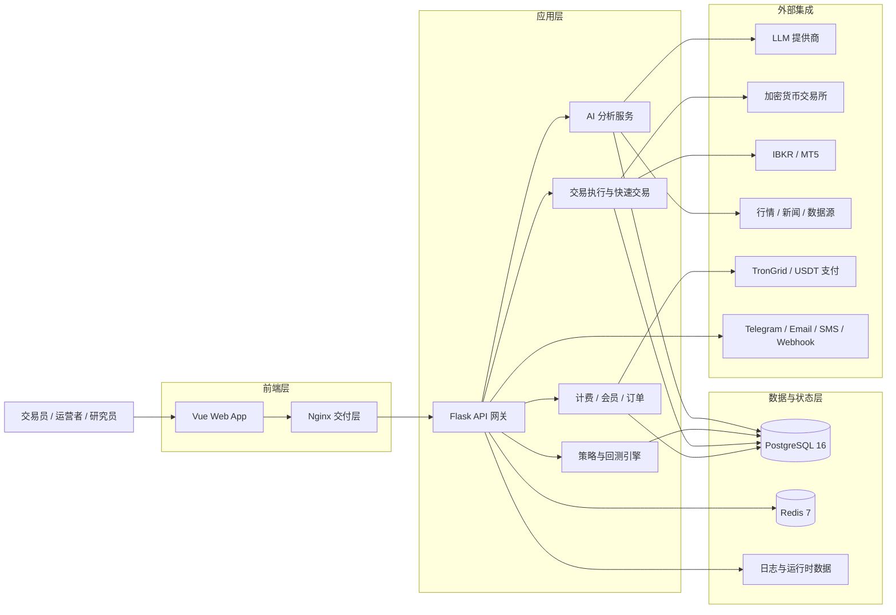

<div align="center">
  <a href="https://github.com/brokermr810/QuantDinger">
    
  </a>

  <h1>QuantDinger</h1>
  <h3>AI 原生量化研究、策略与交易平台</h3>
  <p><strong>把研究、回测、执行与运营放进同一套可自托管系统。</strong></p>

  <p>
    <a href="../README.md"><strong>English</strong></a> &nbsp;·&nbsp;
    <a href="README_CN.md"><strong>简体中文</strong></a> &nbsp;·&nbsp;
    <a href="https://ai.quantdinger.com"><strong>在线演示</strong></a> &nbsp;·&nbsp;
    <a href="https://youtu.be/HPTVpqL7knM"><strong>视频演示</strong></a> &nbsp;·&nbsp;
    <a href="https://www.quantdinger.com"><strong>社区</strong></a>
  </p>

  <p>
    <a href="../LICENSE"></a>
    
    
    
    
    
  </p>
</div>

---

## 项目概览

QuantDinger 是一个面向真实交易场景的自托管量化交易工作台，将 AI 市场分析、Python 策略开发、回测、实盘执行、组合运营和计费能力整合在同一套系统中。

当前 `v3.0.1` 版本重点在于前端运行时版本统一、文档体系重写和界面细节打磨，同时延续此前版本中已经落地的策略级回测与交易能力。完整版本历史见 [`CHANGELOG.md`](CHANGELOG.md)。

## 为什么选择 QuantDinger

- **自托管优先**：部署、凭证、策略代码和业务数据由您掌控。
- **研究到执行一体化**：行情、AI 分析、指标/策略、回测、下单、监控在同一产品链路中协同。
- **Python 原生**：既支持自然语言辅助生成，也支持直接编写 Python 策略与指标。
- **适合运维落地**：Docker Compose、PostgreSQL、Redis、Nginx、健康检查与环境变量配置已经就位。
- **商业化就绪**：内置会员、积分、USDT 支付和后台管理能力。

## v3.0.1 版本重点

- 前端版本标识、运行时展示与文档说明统一到 `3.0.1`。
- `README.md` 与中文版首页文档整体重写，对齐当前真实产品能力与部署方式。
- 交易所邀请注册链接已与应用内“开户”入口保持一致。
- 回测中心界面继续打磨，承接此前 `2.2.x` 版本中策略回测链路产品化成果。

## 开源仓库入口

为了方便开发者快速找到对应代码仓，当前公开仓库如下：

| 仓库 | 作用 |
|------|------|
| [QuantDinger](https://github.com/brokermr810/QuantDinger) | 主仓库：后端、部署栈、文档、预构建前端交付 |
| [QuantDinger Frontend](https://github.com/brokermr810/QuantDinger-Vue) | Vue.js 前端源码仓库，适合界面开发与定制 |

## 核心能力

### 1. AI 研究与决策支持

- 提供结构化 AI 市场分析流程，用于趋势研判、交易思路整理和历史回顾。
- 可综合价格、K 线、宏观、新闻、基本面等多源输入进行分析。
- 支持记忆检索、相似模式召回与校准机制。
- 通过环境变量接入 OpenRouter、OpenAI、Gemini、DeepSeek 等多种 LLM 提供商。

### 2. 指标与策略工作台

- 支持自然语言辅助生成策略，加快从交易想法到可执行逻辑的转化。
- 支持使用 Python 直接编写指标和策略，便于团队深度定制。
- 集成专业 K 线图与信号可视化工作流。
- 支持指标发布、社区分发与商品化路径。

### 3. 回测与策略持久化

- 提供历史回测、收益曲线、交易明细与结果存档能力。
- 支持指标型回测与已保存策略驱动的回测流程。
- 具备策略快照、配置持久化与历史复盘能力。
- 可作为 AI 复盘建议与策略迭代的数据基础。

### 4. 实盘执行与交易联动

- 通过统一交易执行层连接多家加密货币交易所。
- 提供快速交易链路，方便从分析结论直接进入下单场景。
- 支持仓位查询、交易历史跟踪与平仓工作流。
- 内置策略运行时与执行服务，适合半自动或自动化交易运营。

### 5. 多市场覆盖

- 覆盖加密货币现货与衍生品市场。
- 支持通过 IBKR 接入美股交易链路。
- 支持通过 MT5 接入外汇场景。
- 支持 Polymarket 预测市场分析与机会评估流程。

### 6. 组合、通知与运营能力

- 提供投资组合视图与监控能力。
- 支持 Telegram、Email、SMS、Discord、Webhook 等通知链路。
- 后台可配置部分系统行为、功能开关与运行参数。
- 支持待执行订单、组合监控、反思与校准等可选工作器。

### 7. 安全与多用户管理

- 基于 PostgreSQL 的多用户体系。
- 支持管理员、经理、普通用户、只读用户等角色化权限模型。
- 支持 Google 与 GitHub OAuth 登录集成。
- 支持限流、邮箱验证、人机验证等安全配置。

### 8. 计费与商业化能力

- 会员方案支持月度、年度、终身等配置方式。
- 可对 AI 功能进行按积分计费。
- 支持 USDT TRC20 链上支付与对账流程。
- 提供后台订单、用户、积分与计费运营能力。

## 视觉导览

<table align="center" width="100%">
  <tr>
    <td colspan="2" align="center">
      <a href="https://youtu.be/HPTVpqL7knM"></a>
    </td>
  </tr>
  <tr>
    <td width="50%" align="center"><br/><sub>指标 IDE、图表研究、回测与快速交易</sub></td>
    <td width="50%" align="center"><br/><sub>AI 资产分析与机会雷达</sub></td>
  </tr>
  <tr>
    <td align="center"><br/><sub>交易机器人工作台与自动化模板</sub></td>
    <td align="center"><br/><sub>策略与实盘运营、绩效与监控</sub></td>
  </tr>
</table>

## 快速开始

> 仅需安装 [Docker](https://docs.docker.com/get-docker/)。由于仓库已内置 `frontend/dist`，部署时不需要再安装 Node.js 构建前端。

```bash
git clone https://github.com/brokermr810/QuantDinger.git
cd QuantDinger
cp backend_api_python/env.example backend_api_python/.env
./scripts/generate-secret-key.sh
docker-compose up -d --build
```

Windows PowerShell：

```powershell
git clone https://github.com/brokermr810/QuantDinger.git
cd QuantDinger
Copy-Item backend_api_python\env.example -Destination backend_api_python\.env
$key = py -c "import secrets; print(secrets.token_hex(32))"
(Get-Content backend_api_python\.env) -replace '^SECRET_KEY=.*$', "SECRET_KEY=$key" | Set-Content backend_api_python\.env -Encoding UTF8
docker-compose up -d --build
```

启动后：

- 前端地址：`http://localhost:8888`
- 后端健康检查：`http://localhost:5000/api/health`
- 默认登录：`quantdinger` / `123456`

部署注意事项：

- 如果 `SECRET_KEY` 仍为默认值，后端容器会拒绝启动。
- 主配置文件位于 `../backend_api_python/.env`。
- 根目录 `.env` 是可选项，主要用于镜像源和端口覆盖。
- 默认 Docker 栈包含 `frontend`、`backend`、`postgres`、`redis` 四个服务。

### 常用 Docker 命令

```bash
docker-compose ps
docker-compose logs -f backend
docker-compose restart backend
docker-compose up -d --build
docker-compose down
```

### 可选根目录 `.env`

如需自定义端口或镜像源，可在项目根目录创建 `.env`：

```ini
FRONTEND_PORT=3000
BACKEND_PORT=127.0.0.1:5001
IMAGE_PREFIX=docker.m.daocloud.io/library/
```

## 支持的交易所与经纪商

### 加密货币交易所

| 平台 | 覆盖范围 |
|------|----------|
| Binance | 现货、期货、杠杆 |
| OKX | 现货、永续、期权 |
| Bitget | 现货、期货、跟单 |
| Bybit | 现货、线性期货 |
| Coinbase | 现货 |
| Kraken | 现货、期货 |
| KuCoin | 现货、期货 |
| Gate.io | 现货、期货 |
| Deepcoin | 衍生品接入 |
| HTX | 现货、USDT 本位永续 |

### 传统市场

| 市场 | 经纪商 / 数据源 | 执行方式 |
|------|------------------|----------|
| 美股 | IBKR、Yahoo Finance、Finnhub | 通过 IBKR |
| 外汇 | MT5、OANDA | 通过 MT5 |
| 期货 | 交易所 / 数据接入 | 数据与工作流支持 |

### 预测市场

Polymarket 当前定位为**分析型工作流**，支持市场搜索、概率差异分析、机会评分、历史记录与计费联动，适合研究与判断，不应表述为直接实盘执行。

## 架构与技术栈

| 层级 | 技术 |
|------|------|
| 前端 | 预构建 Vue 应用，由 Nginx 托管 |
| 后端 | Flask API + Python 服务层 + 策略运行时 |
| 数据库 | PostgreSQL 16 |
| 缓存 / 工作器支撑 | Redis 7 |
| 交易层 | 多交易所适配、IBKR、MT5 |
| AI 层 | LLM 接入、记忆、校准、可选工作器 |
| 计费层 | 会员、积分、USDT TRC20 支付 |
| 部署 | 带健康检查的 Docker Compose |

### 系统架构图



这张图对应 QuantDinger 的真实系统边界：核心应用自托管运行，内部以 PostgreSQL 和 Redis 为主支撑，外部接入模型、交易所、经纪商、行情数据、支付与通知服务。

```text
┌──────────────────────────────────────────────┐
│                Docker Compose                │
│                                              │
│  frontend (Nginx)     -> :8888               │
│          │                                   │
│          └── /api/* 反向代理 ────────────┐   │
│                                           │   │
│  backend (Flask API) -> :5000            │   │
│          │                                │   │
│          ├── PostgreSQL 16               │   │
│          ├── Redis 7                     │   │
│          └── 外部服务                    │   │
│              LLM、交易所、经纪商、       │   │
│              数据提供商、TronGrid        │   │
└──────────────────────────────────────────────┘
```

### 仓库结构

```text
QuantDinger/
├── backend_api_python/      # 开源后端源码
│   ├── app/routes/          # REST 接口
│   ├── app/services/        # AI、交易、计费、回测、集成能力
│   ├── migrations/init.sql  # 数据库初始化
│   ├── env.example          # 主配置模板
│   └── Dockerfile
├── frontend/                # 预构建前端交付包
│   ├── dist/
│   ├── Dockerfile
│   └── nginx.conf
├── docs/                    # 产品与部署文档
├── docker-compose.yml
├── LICENSE
└── TRADEMARKS.md
```

### 主要配置域

以 `../backend_api_python/env.example` 作为主模板，常用配置包括：

| 配置域 | 示例 |
|--------|------|
| 认证 | `SECRET_KEY`、`ADMIN_USER`、`ADMIN_PASSWORD` |
| 数据库 | `DATABASE_URL` |
| LLM / AI | `LLM_PROVIDER`、`OPENROUTER_API_KEY`、`OPENAI_API_KEY` |
| OAuth | `GOOGLE_CLIENT_ID`、`GITHUB_CLIENT_ID` |
| 安全 | `TURNSTILE_SITE_KEY`、`ENABLE_REGISTRATION` |
| 计费 | `BILLING_ENABLED`、`BILLING_COST_AI_ANALYSIS` |
| 会员 | `MEMBERSHIP_MONTHLY_PRICE_USD`、`MEMBERSHIP_MONTHLY_CREDITS` |
| USDT 支付 | `USDT_PAY_ENABLED`、`USDT_TRC20_XPUB`、`TRONGRID_API_KEY` |
| 代理 | `PROXY_URL` |
| 工作器 | `ENABLE_PENDING_ORDER_WORKER`、`ENABLE_PORTFOLIO_MONITOR`、`ENABLE_REFLECTION_WORKER` |
| AI 调优 | `ENABLE_AI_ENSEMBLE`、`ENABLE_CONFIDENCE_CALIBRATION`、`AI_ENSEMBLE_MODELS` |

## QuantDinger 交易所注册链接

以下为 QuantDinger 合作注册链接。通过这些链接开户，可能享受一定手续费返佣，具体以各交易所规则和活动为准。

| 交易所 | 注册链接 |
|--------|----------|
| Binance | [注册开户](https://www.bsmkweb.cc/register?ref=QUANTDINGER) |
| Bitget | [注册开户](https://partner.hdmune.cn/bg/7r4xz8kd) |
| Bybit | [注册开户](https://partner.bybit.com/b/DINGER) |
| OKX | [注册开户](https://www.xqmnobxky.com/join/QUANTDINGER) |
| Gate.io | [注册开户](https://www.gateport.company/share/DINGER) |
| HTX | [注册开户](https://www.htx.com/invite/zh-cn/1f?invite_code=dinger) |

这些入口也可在网页端登录后通过 **个人中心 -> 开户** 查看。

## 文档索引

### 核心文档

| 文档 | 说明 |
|------|------|
| [更新日志](CHANGELOG.md) | 版本历史与迁移说明 |
| [多用户部署](multi-user-setup.md) | PostgreSQL 多用户部署说明 |
| [云服务器部署](CLOUD_DEPLOYMENT_CN.md) | 域名、HTTPS、反向代理与云上部署 |

### 策略开发

| 指南 | EN | CN | TW | JA | KO |
|------|----|----|----|----|----|
| 策略开发 | [EN](STRATEGY_DEV_GUIDE.md) | [CN](STRATEGY_DEV_GUIDE_CN.md) | [TW](STRATEGY_DEV_GUIDE_TW.md) | [JA](STRATEGY_DEV_GUIDE_JA.md) | [KO](STRATEGY_DEV_GUIDE_KO.md) |
| 跨品种策略 | [EN](CROSS_SECTIONAL_STRATEGY_GUIDE_EN.md) | [CN](CROSS_SECTIONAL_STRATEGY_GUIDE_CN.md) | - | - | - |
| 示例代码 | [examples](examples/) | - | - | - | - |

### 集成说明

| 主题 | English | 中文 |
|------|---------|------|
| IBKR | [Guide](IBKR_TRADING_GUIDE_EN.md) | - |
| MT5 | [Guide](MT5_TRADING_GUIDE_EN.md) | [指南](MT5_TRADING_GUIDE_CN.md) |
| OAuth | [Guide](OAUTH_CONFIG_EN.md) | [指南](OAUTH_CONFIG_CN.md) |

### 通知配置

| 渠道 | English | 中文 |
|------|---------|------|
| Telegram | [Setup](NOTIFICATION_TELEGRAM_CONFIG_EN.md) | [配置](NOTIFICATION_TELEGRAM_CONFIG_CH.md) |
| Email | [Setup](NOTIFICATION_EMAIL_CONFIG_EN.md) | [配置](NOTIFICATION_EMAIL_CONFIG_CH.md) |
| SMS | [Setup](NOTIFICATION_SMS_CONFIG_EN.md) | [配置](NOTIFICATION_SMS_CONFIG_CH.md) |

## 许可与商业说明

- 后端源代码采用 **Apache License 2.0**，见 [`../LICENSE`](../LICENSE)。
- 当前主仓库中的前端以**预构建文件**形式分发，用于一体化部署交付。
- 前端源码单独公开在 [QuantDinger Frontend](https://github.com/brokermr810/QuantDinger-Vue)，并适用 **QuantDinger Frontend Source-Available License v1.0**。
- 根据该前端许可证，非商业用途以及符合条件的非营利机构用途可免费使用；商业用途需另行获得版权方的商业授权。
- 商标、品牌、署名和水印相关规则单独管理，未经许可不得移除或修改，详见 [`../TRADEMARKS.md`](../TRADEMARKS.md)。

如需商业授权、前端源码、品牌授权或部署支持，可联系：

- Website: [quantdinger.com](https://quantdinger.com)
- Telegram: [t.me/worldinbroker](https://t.me/worldinbroker)
- Email: [brokermr810@gmail.com](mailto:brokermr810@gmail.com)

## 法律声明与合规提示

- QuantDinger 仅可用于合法的研究、教育、系统开发，以及符合法律法规要求的交易或运营场景。
- 任何个人或组织不得将本软件、其衍生版本或相关服务用于任何违法、欺诈、滥用、误导、市场操纵、违反制裁、洗钱或其他被法律法规禁止的用途。
- 任何基于 QuantDinger 的商业使用、部署、运营、转售或服务化提供，都必须遵守使用地所属国家或地区的适用法律法规，以及必要的许可、制裁、税务、数据保护、消费者保护、金融监管、市场规则和交易所规则。
- 用户应自行判断其使用行为在所在国家或地区是否合法，并自行承担取得审批、备案、披露、牌照或专业法律/税务/合规意见的责任。
- QuantDinger 及其版权方、贡献者、许可方、维护者和相关开源参与方，不提供任何法律、税务、投资、合规或监管意见。
- 在适用法律允许的最大范围内，QuantDinger 及相关权利方和贡献者，对任何因使用或误用本软件而导致的违法使用、监管违规、交易损失、服务中断、执法措施或其他后果，不承担责任。

## 社区与支持

<p>
  <a href="https://t.me/quantdinger"></a>
  <a href="https://discord.com/invite/tyx5B6TChr"></a>
  <a href="https://youtube.com/@quantdinger"></a>
</p>

- [贡献指南](../CONTRIBUTING.md)
- [问题反馈 / 功能建议](https://github.com/brokermr810/QuantDinger/issues)
- Email: [brokermr810@gmail.com](mailto:brokermr810@gmail.com)

## 支持项目

```text
0x96fa4962181bea077f8c7240efe46afbe73641a7
```

## 致谢

QuantDinger 建立在优秀的开源生态之上，特别感谢以下项目：

- [Flask](https://flask.palletsprojects.com/)
- [Pandas](https://pandas.pydata.org/)
- [CCXT](https://github.com/ccxt/ccxt)
- [yfinance](https://github.com/ranaroussi/yfinance)
- [Vue.js](https://vuejs.org/)
- [Ant Design Vue](https://antdv.com/)
- [KLineCharts](https://github.com/klinecharts/KLineChart)
- [ECharts](https://echarts.apache.org/)
- [Capacitor](https://capacitorjs.com/)
- [bip-utils](https://github.com/ebellocchia/bip_utils)

<p align="center"><sub>如果 QuantDinger 对您有帮助，欢迎为项目点一个 GitHub Star。</sub></p>
