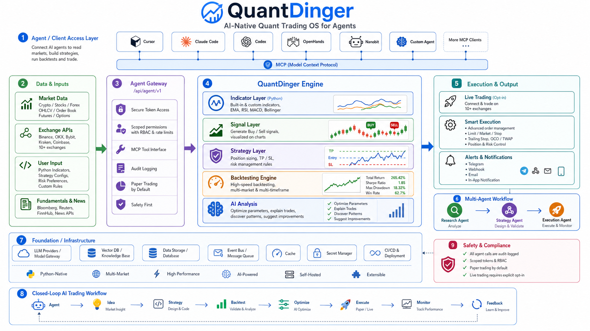
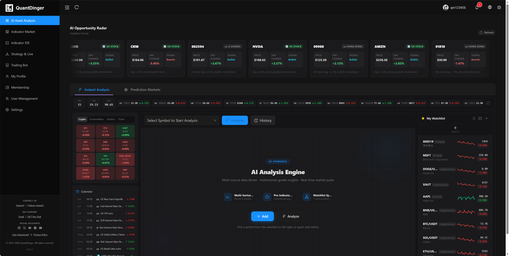
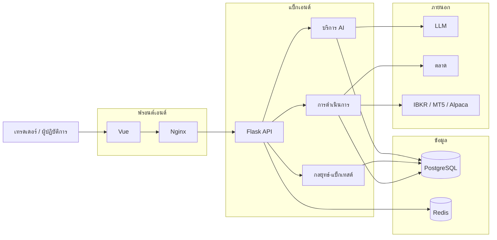

<div align="center">
  <a href="https://github.com/brokermr810/QuantDinger">
    
  </a>

  <h1>QuantDinger</h1>
  <h3>ระบบปฏิบัติการเทรดเชิงปริมาณ AI ส่วนตัวของคุณ</h3>
  <p><strong>สแต็กเดียวสำหรับวิจัยกราฟ การวิเคราะห์ตลาดด้วย AI อินดิเคเตอร์และกลยุทธ์ Python การทดสอบย้อนหลัง และการเทรดจริง—บนเซิร์ฟเวอร์ของคุณและคีย์ API ของคุณ</strong></p>
  <p><em>แพลตฟอร์มเทรดเชิงปริมาณแบบ self-hosted: ตั้งแต่ไอเดียและการเขียนโค้ดช่วยด้วย AI ไปจนถึงเวิร์กโฟลว์แบบเทรดจำลองและเทรดจริงที่เชื่อมต่อกับตลาด พร้อมตัวเลือกหลายผู้ใช้และการเรียกเก็บเงิน</em></p>

  <div align="center" style="max-width: 680px; margin: 1.25rem auto 0; padding: 20px 22px 22px; border: 1px solid #d1d9e0; border-radius: 16px;">
    <p style="margin: 0 0 14px; line-height: 1.65;">
      <a href="../README.md"><strong>English</strong></a>
      <span style="color: #afb8c1;"> · </span>
      <a href="README_CN.md"><strong>简体中文</strong></a>
      <span style="color: #afb8c1;"> · </span>
      <a href="README_JA.md"><strong>日本語</strong></a>
      <span style="color: #afb8c1;"> · </span>
      <a href="README_KO.md"><strong>한국어</strong></a>
      <span style="color: #afb8c1;"> · </span>
      <a href="README_TH.md"><strong>ไทย</strong></a>
      <span style="color: #afb8c1;"> · </span>
      <a href="README_VI.md"><strong>Tiếng Việt</strong></a>
      <span style="color: #afb8c1;"> · </span>
      <a href="README_AR.md"><strong>العربية</strong></a>
    </p>
    <p style="margin: 0 0 18px; padding-bottom: 16px; border-bottom: 1px solid #eaeef2; line-height: 2;">
      <a href="https://ai.quantdinger.com"><strong>SaaS</strong></a>
      <span style="color: #d8dee4;"> &nbsp;·&nbsp; </span>
      <a href="https://www.youtube.com/watch?v=tNAZ9uMiUUw"><strong>วิดีโอสาธิต</strong></a>
      <span style="color: #d8dee4;"> &nbsp;·&nbsp; </span>
      <a href="https://www.quantdinger.com"><strong>เว็บไซต์</strong></a>
      <span style="color: #d8dee4;"> &nbsp;·&nbsp; </span>
      <a href="https://aws.amazon.com/marketplace/pp/prodview-naanrb7d2mbc6"><strong>AWS Marketplace</strong></a>
    </p>
    <p style="margin: 0; line-height: 2;">
      <a href="https://t.me/quantdinger"></a>
      &nbsp;
      <a href="https://discord.com/invite/tyx5B6TChr"></a>
      &nbsp;
      <a href="https://youtube.com/@quantdinger"></a>
      &nbsp;
      <a href="https://x.com/QuantDinger_EN"></a>
    </p>
  </div>

  <p style="margin-top: 1.45rem; margin-bottom: 10px;">
    <a href="../LICENSE"></a>
    
    
    
    
  </p>
</div>

---

## สารบัญ

[เริ่มต้นอย่างรวดเร็ว](#เริ่มต้นอย่างรวดเร็ว) · [ที่เก็บที่เกี่ยวข้อง](#ที่เก็บที่เกี่ยวข้อง) · [MCP / Agent](#mcp--agent-gateway) · [ภาพรวม](#ภาพรวมผลิตภัณฑ์) · [คุณสมบัติ](#ไฮไลต์คุณสมบัติ) · [ภาพหน้าจอ](#ทัวร์ภาพ) · [สถาปัตยกรรม](#สถาปัตยกรรม) · [ติดตั้ง](#การติดตั้งและการเริ่มต้น) · [เอกสาร](#รายการเอกสาร) · [คำถามที่พบบ่อย](#คำถามที่พบบ่อย) · [ใบอนุญาต](#ใบอนุญาต)

---

> QuantDinger เป็นแพลตฟอร์มเทรดเชิงปริมาณแบบ **self-hosted และเน้นโลคัล** รวม **การวิจัยช่วยด้วย AI** **กลยุทธ์ Python แบบเนทีฟ** **การทดสอบย้อนหลัง** และ **การเทรดจริง** (คริปโต, IBKR หุ้นสหรัฐ, MT5 FX, Alpaca หุ้นสหรัฐ / ETF / คริปโต) ไว้ใน **ผลิตภัณฑ์เดียว**

<div align="center">
  
  <p><sub><em>ลูปปิดจากแหล่งข้อมูลไปยังอินดิเคเตอร์ สัญญาณ กลยุทธ์ การทดสอบย้อนหลัง การวิเคราะห์ AI และการดำเนินการ</em></sub></p>
</div>

## เริ่มต้นอย่างรวดเร็ว

**สิ่งที่ต้องมี:** [Docker](https://docs.docker.com/get-docker/) + Compose และ **Git** **ไม่ต้องใช้ Node.js** (UI สำเร็จรูปใน `frontend/dist`)

### macOS / Linux

```bash
git clone https://github.com/brokermr810/QuantDinger.git && cd QuantDinger && cp backend_api_python/env.example backend_api_python/.env && chmod +x scripts/generate-secret-key.sh && ./scripts/generate-secret-key.sh && docker-compose up -d --build
```

หากไม่มี `docker-compose` ให้ลอง `docker compose`

### Windows (PowerShell)

เปิด **Docker Desktop** แล้วรันใน PowerShell:

```powershell
git clone https://github.com/brokermr810/QuantDinger.git
Set-Location QuantDinger
Copy-Item backend_api_python\env.example -Destination backend_api_python\.env
$key = & python -c "import secrets; print(secrets.token_hex(32))" 2>$null
if (-not $key) { $key = & py -c "import secrets; print(secrets.token_hex(32))" 2>$null }
if (-not $key) { Write-Error "เพิ่ม Python 3 ลงใน PATH" }
(Get-Content backend_api_python\.env) -replace '^SECRET_KEY=.*$', "SECRET_KEY=$key" | Set-Content backend_api_python\.env -Encoding utf8
docker-compose up -d --build
```

### Windows (Git Bash)

ใน Bash ของ Git for Windows สามารถใช้คำสั่งบรรทัดเดียวของ macOS/Linux ได้

---

เปิด **`http://localhost:8888`** ล็อกอินด้วย **`quantdinger` / `123456`** แล้ว **เปลี่ยนรหัสผู้ดูแลระบบทันที** รายละเอียดเพิ่มเติมอยู่ที่ [การติดตั้งและการเริ่มต้น](#การติดตั้งและการเริ่มต้น)

## ที่เก็บที่เกี่ยวข้อง

| ที่เก็บ | เนื้อหา |
|---------|---------|
| **[QuantDinger](https://github.com/brokermr810/QuantDinger)** (repo นี้) | แบ็กเอนด์ Compose เอกสาร Web สำเร็จรูป |
| **[QuantDinger-Vue](https://github.com/brokermr810/QuantDinger-Vue)** | **ซอร์สเว็บฟรอนต์** (Vue) — รัน `npm run build` แล้วแทนที่ `frontend/dist` |
| **[QuantDinger-Mobile](https://github.com/brokermr810/QuantDinger-Mobile)** | **ไคลเอนต์มือถือ** (โอเพนซอร์ส) |

<h2 id="mcp--agent-gateway">MCP / Agent Gateway</h2>

สำหรับ **Cursor / Claude Code / Codex** มี **Model Context Protocol (MCP)** และ **Agent Gateway** (`/api/agent/v1`) รายละเอียดเชิงลึกอยู่ในเอกสารภาษาอังกฤษ:

- **คู่มือเชื่อมต่อ:** [**MCP_SETUP.md**](agent/MCP_SETUP.md) — โฮสต์ / Self-hosted, stdio ในเครื่อง, HTTP ระยะไกล, Claude Code CLI รวมในที่เดียว
- [AGENT_QUICKSTART.md](agent/AGENT_QUICKSTART.md) · [AI_INTEGRATION_DESIGN.md](agent/AI_INTEGRATION_DESIGN.md) · [agent-openapi.json](agent/agent-openapi.json)
- เซิร์ฟเวอร์ MCP: [`../mcp_server/README.md`](../mcp_server/README.md) · PyPI [`quantdinger-mcp`](https://pypi.org/project/quantdinger-mcp/)

**ความปลอดภัย:** การเรียก Agent ทุกครั้งถูกบันทึกใน audit log โทเค็นการเทรด (T) เริ่มต้นเป็น **เทรดจำลองเท่านั้น** การเทรดจริงต้องมีทั้ง `AGENT_LIVE_TRADING_ENABLED=true` บนเซิร์ฟเวอร์และ `paper_only=false` บนโทเค็น

## ภาพรวมผลิตภัณฑ์

สภาพแวดล้อมรวม **AI + กลยุทธ์ Python + การทดสอบย้อนหลัง + เทรดจริง** ที่โฮสต์เองได้ ข้อมูลรับรองอยู่ใน **PostgreSQL** และ **`.env`** การเชื่อมต่อตลาดคริปโต IBKR MT5 Alpaca และ LLM ผ่านตัวแปรสภาพแวดล้อม

## ทัวร์ภาพ

<table align="center" width="100%">
  <tr>
    <td colspan="2" align="center">
      <a href="https://www.youtube.com/watch?v=wHIvvv6fmHA">
        
      </a>
      <br/><sub><a href="https://www.youtube.com/watch?v=wHIvvv6fmHA"><strong>▶ ดูวิดีโอสาธิต</strong></a></sub>
    </td>
  </tr>
  <tr>
    <td width="50%" align="center"><br/><sub>IDE อินดิเคเตอร์ กราฟ การทดสอบย้อนหลัง</sub></td>
    <td width="50%" align="center"><br/><sub>การวิเคราะห์สินทรัพย์ด้วย AI</sub></td>
  </tr>
  <tr>
    <td align="center"><br/><sub>บอทเทรด</sub></td>
    <td align="center"><br/><sub>กลยุทธ์จริงและผลงาน</sub></td>
  </tr>
</table>

## ไฮไลต์คุณสมบัติ

- **วิจัย & AI** — วิเคราะห์หลาย LLM รายการโปรด ประวัติ NL→โค้ด การเชื่อม **Agent / MCP**
- **สร้าง** — `IndicatorStrategy` และ `ScriptStrategy` (`on_bar`) UI แท่งเทียนระดับโปร
- **ตรวจสอบ** — ทดสอบย้อนหลังฝั่งเซิร์ฟเวอร์ เส้น equity
- **ปฏิบัติการ** — ดำเนินการคริปโต เทรดเร็ว IBKR / MT5 / Alpaca (หุ้นสหรัฐ · ETF · คริปโต) Telegram อีเมล Discord Webhook ฯลฯ
- **แพลตฟอร์ม** — Docker Compose Postgres Redis OAuth หลายผู้ใช้ เครดิต สมาชิก USDT สวิตช์การเรียกเก็บเงิน

## สถาปัตยกรรม



## การติดตั้งและการเริ่มต้น

1. โคลนแล้ว `cp backend_api_python/env.example backend_api_python/.env`
2. **ต้องตั้ง `SECRET_KEY`** (ถ้าเป็นค่า placeholder แบ็กเอนด์จะไม่เริ่ม) Linux/macOS: `./scripts/generate-secret-key.sh`
3. `docker-compose up -d --build`
   - **ทางเลือก (ไม่ต้อง clone repo)**: ดึงอิมเมจ backend + frontend สำเร็จรูปแบบหลายสถาปัตยกรรม (amd64/arm64) จาก GHCR โดยตรง:
     ```bash
     curl -O https://raw.githubusercontent.com/brokermr810/QuantDinger/main/docker-compose.ghcr.yml
     curl -o backend.env https://raw.githubusercontent.com/brokermr810/QuantDinger/main/backend_api_python/env.example
     docker compose -f docker-compose.ghcr.yml up -d
     ```
     อิมเมจเริ่มต้น: `ghcr.io/brokermr810/quantdinger-{backend,frontend}:latest` ตรึงเวอร์ชันด้วย `IMAGE_TAG=v3.0.7` ใน `.env` ที่อยู่ในเครื่อง
4. **เว็บ:** `http://localhost:8888` · **สุขภาพ API:** `http://localhost:5000/api/health`
5. เปลี่ยนรหัสผู้ดูแลเริ่มต้นก่อนโปรดักชัน ตั้ง **`FRONTEND_URL`** ใน `backend_api_python/.env` ให้ตรง URL จริง

ฟีเจอร์ AI: คัดลอกส่วน **AI / LLM** จาก `env.example` ไปยัง `.env` แล้วรีสตาร์ทแบ็กเอนด์ รายการตรวจสอบแบบเต็มอยู่ใน [README ภาษาอังกฤษ](../README.md) หรือ [简体中文](README_CN.md)

## รายการเอกสาร

| เอกสาร | คำอธิบาย |
|---------|----------|
| [English README](../README.md) | ฉบับเต็ม (อังกฤษ) |
| [简体中文](README_CN.md) | ฉบับเต็ม (จีนตัวย่อ) |
| [CHANGELOG](CHANGELOG.md) | ประวัติเวอร์ชัน |
| [Agent เริ่มต้น](agent/AGENT_QUICKSTART.md) (อังกฤษ) | Agent Gateway / ตัวอย่าง curl |
| [คู่มือกลยุทธ์ (อังกฤษ)](STRATEGY_DEV_GUIDE.md) | พัฒนากลยุทธ์อินดิเคเตอร์·สคริปต์ |

อื่น ๆ: [multi-user-setup.md](multi-user-setup.md) · [IBKR](IBKR_TRADING_GUIDE_EN.md) · [MT5](MT5_TRADING_GUIDE_EN.md) — รายละเอียดหลักเป็นภาษาอังกฤษ

## คำถามที่พบบ่อย

**โฮสต์เองได้จริงหรือ?** ได้ ใช้ Docker Compose บนโครงสร้างของคุณ

**มีแค่คริปโตหรือ?** ไม่ใช่ รองรับ IBKR / Alpaca (หุ้นสหรัฐ · ETF · คริปโต) และ MT5 (FX)

**เขียนกลยุทธ์ด้วย Python ได้ไหม?** ได้ รองรับ `IndicatorStrategy` และ `ScriptStrategy`

**ใช้เชิงพาณิชย์?** แบ็กเอนด์เป็น **Apache 2.0** ฟรอนต์ [QuantDinger-Vue](https://github.com/brokermr810/QuantDinger-Vue) มีใบอนุญาตแยก—อ่านก่อนใช้เชิงพาณิชย์ มือถือตาม [QuantDinger-Mobile](https://github.com/brokermr810/QuantDinger-Mobile)

**มีแอปมือถือไหม?** ดู [QuantDinger-Mobile](https://github.com/brokermr810/QuantDinger-Mobile)

## ลิงก์แนะนำตลาด (อ้างอิง)

| ตลาด | ลิงก์ |
|------|------|
| Binance | [ลงทะเบียน](https://www.bsmkweb.cc/register?ref=QUANTDINGER) |
| OKX | [ลงทะเบียน](https://www.xqmnobxky.com/join/QUANTDINGER) |
| Bybit | [ลงทะเบียน](https://partner.bybit.com/b/DINGER) |

## ใบอนุญาต

- แบ็กเอนด์: **Apache License 2.0** ([`../LICENSE`](../LICENSE))
- UI เว็บที่แนบมา: แจกแบบสำเร็จรูป ซอร์สที่ [QuantDinger-Vue](https://github.com/brokermr810/QuantDinger-Vue) (ใบอนุญาตแยก)
- เครื่องหมายการค้า: [`../TRADEMARKS.md`](../TRADEMARKS.md)

## ข้อจำกัดความรับผิด

QuantDinger มีไว้สำหรับการวิจัย การศึกษา และการเทรดที่สอดคล้องกฎหมายเท่านั้น **ไม่ใช่คำแนะนำการลงทุน** การใช้งานเป็นความรับผิดชอบของคุณ

## ชุมชน

- [Telegram](https://t.me/quantdinger) · [Discord](https://discord.com/invite/tyx5B6TChr) · [Issues](https://github.com/brokermr810/QuantDinger/issues)
- Email: [support@quantdinger.com](mailto:support@quantdinger.com)

## แนวโน้ม Star

[](https://star-history.com/#brokermr810/QuantDinger&Date)

## ขอบคุณ

ขอบคุณชุมชนโอเพนซอร์ส เช่น Flask, Pandas, CCXT, Vue.js, KLineCharts, ECharts

<p align="center"><sub>ถ้ามีประโยชน์ ช่วยกด Star บน GitHub ด้วย</sub></p>
