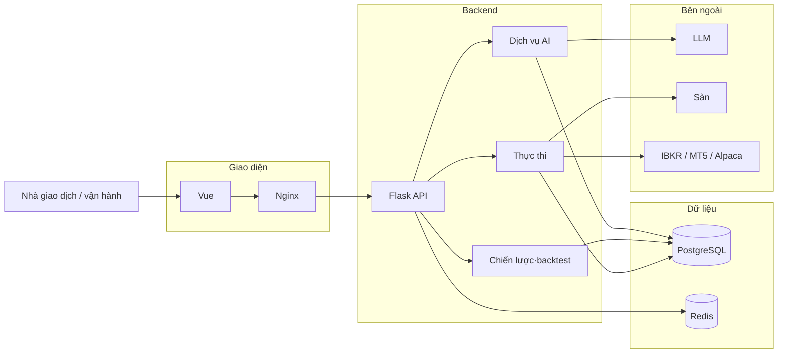

<div align="center">
  <a href="https://github.com/brokermr810/QuantDinger">
    
  </a>

  <h1>QuantDinger</h1>
  <h3>Hệ điều hành giao dịch định lượng AI riêng tư của bạn</h3>
  <p><strong>Một stack triển khai cho nghiên cứu biểu đồ, phân tích thị trường bằng AI, chỉ báo &amp; chiến lược Python, kiểm thử lùi và giao dịch thực—trên máy chủ và khóa API của bạn.</strong></p>
  <p><em>Nền tảng định lượng tự lưu trữ: từ ý tưởng và lập trình hỗ trợ bởi AI đến quy trình giấy và giao dịch thực kết nối sàn; tùy chọn đa người dùng và thanh toán.</em></p>

  <div align="center" style="max-width: 680px; margin: 1.25rem auto 0; padding: 20px 22px 22px; border: 1px solid #d1d9e0; border-radius: 16px;">
    <p style="margin: 0 0 14px; line-height: 1.65;">
      <a href="../README.md"><strong>English</strong></a>
      <span style="color: #afb8c1;"> · </span>
      <a href="README_CN.md"><strong>简体中文</strong></a>
      <span style="color: #afb8c1;"> · </span>
      <a href="README_JA.md"><strong>日本語</strong></a>
      <span style="color: #afb8c1;"> · </span>
      <a href="README_KO.md"><strong>한국어</strong></a>
      <span style="color: #afb8c1;"> · </span>
      <a href="README_TH.md"><strong>ไทย</strong></a>
      <span style="color: #afb8c1;"> · </span>
      <a href="README_VI.md"><strong>Tiếng Việt</strong></a>
      <span style="color: #afb8c1;"> · </span>
      <a href="README_AR.md"><strong>العربية</strong></a>
    </p>
    <p style="margin: 0 0 18px; padding-bottom: 16px; border-bottom: 1px solid #eaeef2; line-height: 2;">
      <a href="https://ai.quantdinger.com"><strong>SaaS</strong></a>
      <span style="color: #d8dee4;"> &nbsp;·&nbsp; </span>
      <a href="https://www.youtube.com/watch?v=tNAZ9uMiUUw"><strong>Video demo</strong></a>
      <span style="color: #d8dee4;"> &nbsp;·&nbsp; </span>
      <a href="https://www.quantdinger.com"><strong>Trang web</strong></a>
      <span style="color: #d8dee4;"> &nbsp;·&nbsp; </span>
      <a href="https://aws.amazon.com/marketplace/pp/prodview-naanrb7d2mbc6"><strong>AWS Marketplace</strong></a>
    </p>
    <p style="margin: 0; line-height: 2;">
      <a href="https://t.me/quantdinger"></a>
      &nbsp;
      <a href="https://discord.com/invite/tyx5B6TChr"></a>
      &nbsp;
      <a href="https://youtube.com/@quantdinger"></a>
      &nbsp;
      <a href="https://x.com/QuantDinger_EN"></a>
    </p>
  </div>

  <p style="margin-top: 1.45rem; margin-bottom: 10px;">
    <a href="../LICENSE"></a>
    
    
    
    
  </p>
</div>

---

## Mục lục

[Bắt đầu nhanh](#bắt-đầu-nhanh) · [Kho liên quan](#kho-liên-quan) · [MCP / Agent](#mcp--agent-gateway) · [Tổng quan](#tổng-quan-sản-phẩm) · [Tính năng](#điểm-nổi-bật) · [Ảnh màn hình](#tour-hình-ảnh) · [Kiến trúc](#kiến-trúc) · [Cài đặt](#cài-đặt-và-chạy-lần-đầu) · [Tài liệu](#danh-sách-tài-liệu) · [FAQ](#câu-hỏi-thường-gặp) · [Giấy phép](#giấy-phép)

---

> QuantDinger là nền tảng định lượng **tự lưu trữ, ưu tiên cục bộ**, gom **nghiên cứu hỗ trợ AI**, **chiến lược Python gốc**, **kiểm thử lùi** và **giao dịch thực** (tiền mã hóa, cổ phiếu Mỹ qua IBKR, FX qua MT5, cổ phiếu Mỹ / ETF / tiền mã hóa qua Alpaca) trong **một sản phẩm**.

<div align="center">
  
  <p><sub><em>Vòng kín từ nguồn dữ liệu đến chỉ báo, tín hiệu, chiến lược, kiểm thử lùi, phân tích AI và thực thi.</em></sub></p>
</div>

## Bắt đầu nhanh

**Yêu cầu:** [Docker](https://docs.docker.com/get-docker/) + Compose và **Git**. **Không cần Node.js** (giao diện web đã build sẵn trong `frontend/dist`).

### macOS / Linux

```bash
git clone https://github.com/brokermr810/QuantDinger.git && cd QuantDinger && cp backend_api_python/env.example backend_api_python/.env && chmod +x scripts/generate-secret-key.sh && ./scripts/generate-secret-key.sh && docker-compose up -d --build
```

Nếu không có `docker-compose`, dùng `docker compose`.

### Windows (PowerShell)

Bật **Docker Desktop**, rồi trong PowerShell:

```powershell
git clone https://github.com/brokermr810/QuantDinger.git
Set-Location QuantDinger
Copy-Item backend_api_python\env.example -Destination backend_api_python\.env
$key = & python -c "import secrets; print(secrets.token_hex(32))" 2>$null
if (-not $key) { $key = & py -c "import secrets; print(secrets.token_hex(32))" 2>$null }
if (-not $key) { Write-Error "Thêm Python 3 vào PATH." }
(Get-Content backend_api_python\.env) -replace '^SECRET_KEY=.*$', "SECRET_KEY=$key" | Set-Content backend_api_python\.env -Encoding utf8
docker-compose up -d --build
```

### Windows (Git Bash)

Trong Bash của Git for Windows có thể dùng lệnh một dòng như trên macOS/Linux.

---

Mở **`http://localhost:8888`**, đăng nhập **`quantdinger` / `123456`**, rồi **đổi mật khẩu quản trị ngay**. Chi tiết xem [Cài đặt và chạy lần đầu](#cài-đặt-và-chạy-lần-đầu).

## Kho liên quan

| Kho | Nội dung |
|-----|----------|
| **[QuantDinger](https://github.com/brokermr810/QuantDinger)** (kho này) | Backend, Compose, tài liệu, web đã build |
| **[QuantDinger-Vue](https://github.com/brokermr810/QuantDinger-Vue)** | **Mã nguồn web** (Vue) — `npm run build` rồi thay `frontend/dist` |
| **[QuantDinger-Mobile](https://github.com/brokermr810/QuantDinger-Mobile)** | **Ứng dụng di động** (mã nguồn mở) |

<h2 id="mcp--agent-gateway">MCP / Agent Gateway</h2>

Dành cho **Cursor / Claude Code / Codex**: **Model Context Protocol (MCP)** và **Agent Gateway** (`/api/agent/v1`). Tài liệu chi tiết bằng tiếng Anh là nguồn chính:

- [AGENT_QUICKSTART.md](agent/AGENT_QUICKSTART.md) · [AI_INTEGRATION_DESIGN.md](agent/AI_INTEGRATION_DESIGN.md) · [agent-openapi.json](agent/agent-openapi.json)
- Máy chủ MCP: [`../mcp_server/README.md`](../mcp_server/README.md) · PyPI [`quantdinger-mcp`](https://pypi.org/project/quantdinger-mcp/)

**Bảo mật:** Mọi lệnh gọi Agent được ghi vào nhật ký kiểm toán. Token giao dịch (T) mặc định chỉ **giấy**; giao dịch thực cần cả `AGENT_LIVE_TRADING_ENABLED=true` trên máy chủ và `paper_only=false` trên token.

## Tổng quan sản phẩm

Môi trường thống nhất **AI + chiến lược Python + kiểm thử lùi + giao dịch thực**, có thể tự host. Thông tin xác thực nằm trong **PostgreSQL** và **`.env`**. Sàn tiền mã hóa, IBKR, MT5, Alpaca, LLM kết nối qua biến môi trường.

## Tour hình ảnh

<table align="center" width="100%">
  <tr>
    <td colspan="2" align="center">
      <a href="https://www.youtube.com/watch?v=wHIvvv6fmHA">
        
      </a>
      <br/><sub><a href="https://www.youtube.com/watch?v=wHIvvv6fmHA"><strong>▶ Xem video demo</strong></a></sub>
    </td>
  </tr>
  <tr>
    <td width="50%" align="center"><br/><sub>IDE chỉ báo, biểu đồ, kiểm thử lùi</sub></td>
    <td width="50%" align="center"><br/><sub>Phân tích tài sản bằng AI</sub></td>
  </tr>
  <tr>
    <td align="center"><br/><sub>Bot giao dịch</sub></td>
    <td align="center"><br/><sub>Chiến lược thực &amp; hiệu suất</sub></td>
  </tr>
</table>

## Điểm nổi bật

- **Nghiên cứu &amp; AI** — Phân tích đa LLM, danh mục theo dõi, lịch sử; NL→mã; quy trình Polymarket; tích hợp **Agent / MCP**.
- **Xây dựng** — `IndicatorStrategy` và `ScriptStrategy` (`on_bar`); giao diện nến chuyên nghiệp.
- **Xác minh** — Kiểm thử lùi phía máy chủ, đường vốn.
- **Vận hành** — Thực thi tiền mã hóa, giao dịch nhanh, IBKR / MT5 / Alpaca (cổ Mỹ · ETF · tiền mã hóa); Telegram, email, Discord, Webhook, v.v.
- **Nền tảng** — Docker Compose, Postgres, Redis, OAuth, đa người dùng, tín dụng / thành viên / USDT.

## Kiến trúc



## Cài đặt và chạy lần đầu

1. Clone rồi `cp backend_api_python/env.example backend_api_python/.env`
2. **Phải đặt `SECRET_KEY`** (giữ placeholder thì backend không khởi động). Linux/macOS: `./scripts/generate-secret-key.sh`
3. `docker-compose up -d --build`
4. **Web:** `http://localhost:8888` · **Sức khỏe API:** `http://localhost:5000/api/health`
5. Đổi mật khẩu quản trị mặc định trước production. Đặt **`FRONTEND_URL`** trong `backend_api_python/.env` đúng URL thực tế.

Tính năng AI: sao chép mục **AI / LLM** từ `env.example` sang `.env`, rồi khởi động lại backend. Danh sách đầy đủ xem [README tiếng Anh](../README.md) hoặc [简体中文](README_CN.md).

## Danh sách tài liệu

| Tài liệu | Mô tả |
|----------|--------|
| [English README](../README.md) | Bản đầy đủ (Anh) |
| [简体中文](README_CN.md) | Bản đầy đủ (Tiếng Trung giản thể) |
| [CHANGELOG](CHANGELOG.md) | Lịch sử phiên bản |
| [Agent nhanh](agent/AGENT_QUICKSTART.md) (Anh) | Agent Gateway / ví dụ curl |
| [Hướng dẫn chiến lược (Anh)](STRATEGY_DEV_GUIDE.md) | Phát triển chiến lược chỉ báo·script |

Khác: [multi-user-setup.md](multi-user-setup.md) · [IBKR](IBKR_TRADING_GUIDE_EN.md) · [MT5](MT5_TRADING_GUIDE_EN.md) — chi tiết chủ yếu bằng tiếng Anh.

## Câu hỏi thường gặp

**Có thật sự tự host được không?** Có, triển khai bằng Docker Compose trên hạ tầng của bạn.

**Chỉ tiền mã hóa?** Không. Hỗ trợ IBKR / Alpaca (cổ Mỹ · ETF · tiền mã hóa), MT5 (FX), và Polymarket cho nghiên cứu.

**Viết chiến lược bằng Python được không?** Có, hỗ trợ `IndicatorStrategy` và `ScriptStrategy`.

**Thương mại?** Backend **Apache 2.0**. Frontend [QuantDinger-Vue](https://github.com/brokermr810/QuantDinger-Vue) có giấy phép riêng—đọc kỹ trước khi dùng thương mại. Di động theo [QuantDinger-Mobile](https://github.com/brokermr810/QuantDinger-Mobile).

**Có ứng dụng di động không?** Xem [QuantDinger-Mobile](https://github.com/brokermr810/QuantDinger-Mobile).

## Liên kết giới thiệu sàn (tham khảo)

| Sàn | Liên kết |
|-----|----------|
| Binance | [Đăng ký](https://www.bsmkweb.cc/register?ref=QUANTDINGER) |
| OKX | [Đăng ký](https://www.xqmnobxky.com/join/QUANTDINGER) |
| Bybit | [Đăng ký](https://partner.bybit.com/b/DINGER) |

## Giấy phép

- Backend: **Apache License 2.0** ([`../LICENSE`](../LICENSE))
- Web UI đi kèm: phân phối dựng sẵn. Mã nguồn tại [QuantDinger-Vue](https://github.com/brokermr810/QuantDinger-Vue) (giấy phép riêng)
- Thương hiệu: [`../TRADEMARKS.md`](../TRADEMARKS.md)

## Tuyên bố miễn trừ

QuantDinger dành cho nghiên cứu, giáo dục và giao dịch tuân thủ **hợp pháp**. **Không phải tư vấn đầu tư.** Bạn tự chịu trách nhiệm khi sử dụng.

## Cộng đồng

- [Telegram](https://t.me/quantdinger) · [Discord](https://discord.com/invite/tyx5B6TChr) · [Issues](https://github.com/brokermr810/QuantDinger/issues)
- Email: [support@quantdinger.com](mailto:support@quantdinger.com)

## Xu hướng Star

[](https://star-history.com/#brokermr810/QuantDinger&Date)

## Lời cảm ơn

Cảm ơn cộng đồng mã nguồn mở: Flask, Pandas, CCXT, Vue.js, KLineCharts, ECharts và nhiều dự án khác.

<p align="center"><sub>Nếu hữu ích, hãy cho một ngôi sao trên GitHub.</sub></p>
